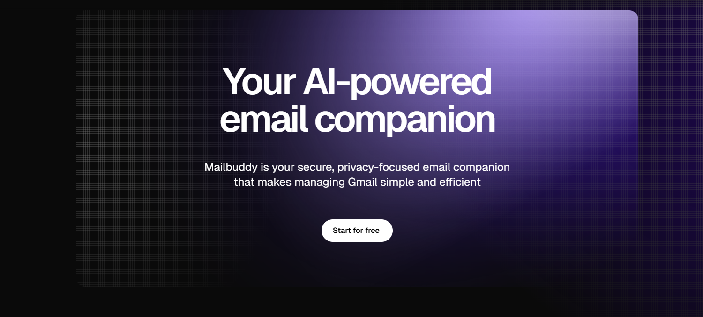

# Mailbuddy - Your Secure AI Email Companion

<div align="center">
  
  <p><em>A modern, secure, and privacy-focused email client with Gmail integration</em></p>
  <p>
    <a href="#key-features">Features</a> •
    <a href="#security">Security</a> •
    <a href="#getting-started">Getting Started</a> •
    <a href="#tech-stack">Tech Stack</a> •
    <a href="#roadmap">Roadmap</a> •
    <a href="#license">License</a>
  </p>
</div>

## 🌟 Overview

Mailbuddy is a sophisticated email client focusing on security, privacy, and user experience. It combines Gmail's powerful API with client-side encryption to ensure your emails remain private while providing a clean, intuitive interface.

### Why Mailbuddy?

- **Privacy First**: Your emails are encrypted with keys only you can access
- **Modern Interface**: Clean, fast UI built with Next.js and Once UI
- **Seamless Integration**: Works with your existing Gmail account
- **Smart Features**: AI-powered email categorization and priority sorting
- **Fully Open Source**: Transparent, community-driven development

## 🔑 Key Features

<div align="center">
  <table>
    <tr>
      <td align="center">🔐</td>
      <td><strong>Zero-Knowledge Architecture</strong> - Your emails are encrypted with keys only you control</td>
    </tr>
    <tr>
      <td align="center">⚡</td>
      <td><strong>Lightning-Fast Experience</strong> - Background syncing and optimized performance</td>
    </tr>
    <tr>
      <td align="center">🧠</td>
      <td><strong>AI-Enhanced Organization</strong> - Smart email categorization and priority detection</td>
    </tr>
    <tr>
      <td align="center">🔄</td>
      <td><strong>Real-Time Syncing</strong> - Changes reflect immediately across devices</td>
    </tr>
    <tr>
      <td align="center">🧵</td>
      <td><strong>Threaded Conversations</strong> - Emails organized into meaningful threads</td>
    </tr>
  </table>
</div>

## 🔒 Security

### User-Specific Encryption

Each user gets their own unique encryption key that secures their email data:

- **Client-Side Encryption**: All sensitive data is encrypted before server storage
- **User-Controlled Keys**: Only you can decrypt and access your email content
- **Data Isolation**: Even in a breach, emails remain secure and unreadable
- **Zero Server Access**: The server never sees the unencrypted content of your emails

### Encrypted Fields

- ✓ Email body content
- ✓ Email subject lines
- ✓ Email snippets/previews
- ✓ Sender and recipient information

### Compliance Ready

Our architecture is designed to help maintain compliance with:
- GDPR
- CCPA
- HIPAA (with proper configuration)

## 🚀 Getting Started

```bash
# Clone the repository
git clone https://github.com/izadoesdev/mailer

# Navigate to project directory
cd Mailbuddy

# Install dependencies
bun install

# Set up environment variables
cp .env.example .env.local
# Fill in required environment variables

# Start development server
bun run dev
```

### Environment Setup

Create a `.env.local` file with the following variables:

```
DATABASE_URL=your_database_connection_string
GOOGLE_CLIENT_ID=your_google_client_id
GOOGLE_CLIENT_SECRET=your_google_client_secret
ENCRYPTION_KEY=your_fallback_encryption_key
```

## 🛠️ Tech Stack

<div align="center">
  <table>
    <tr>
      <td align="center"><strong>Frontend</strong></td>
      <td align="center"><strong>Backend</strong></td>
      <td align="center"><strong>Database</strong></td>
      <td align="center"><strong>AI/ML</strong></td>
    </tr>
    <tr>
      <td>
        • Next.js<br/>
        • React<br/>
        • Once UI<br/>
        • TailwindCSS
      </td>
      <td>
        • Next.js API Routes<br/>
        • Prisma ORM<br/>
        • NextAuth.js<br/>
        • Gmail API
      </td>
      <td>
        • PostgreSQL<br/>
        • Vector storage<br/>
        • Prisma migrations
      </td>
      <td>
        • Email categorization<br/>
        • Priority detection<br/>
        • Smart summaries<br/>
        • Semantic search
      </td>
    </tr>
  </table>
</div>

## 📊 Application Architecture

```
├── src/
│   ├── app/                  # Next.js App Router
│   │   ├── api/              # API routes including inbox and Gmail integration
│   │   ├── auth/             # Authentication pages
│   │   ├── inbox/            # Email inbox views
│   │   ├── ai/               # AI processing for emails
│   │   ├── components/       # Reusable UI components
│   │   ├── libs/             # Utility functions and services
│   │   │   ├── auth/         # Authentication configuration
│   │   │   ├── db/           # Database configuration
│   │   │   ├── utils/        # Utilities including encryption
│   ├── prisma/               # Database schema and migrations
│   └── public/               # Static assets
```

## �� Documentation

<!-- Comprehensive documentation is available at [docs.example.com](https://docs.example.com) covering: -->

- Complete API reference
- Database schema details
- Security implementation guide
- Customization options
- Contributing guidelines

## 🛣️ Roadmap

- [ ] **Custom Folders & Labels**: Create and manage custom organization
- [ ] **Enhanced Search**: Full-text and semantic search capabilities
- [ ] **Mobile Applications**: Native apps for iOS and Android
- [ ] **Offline Mode**: Full functionality without internet connection
- [ ] **End-to-End Encryption**: Secure email sending between Mailbuddy users
- [ ] **Calendar Integration**: View and manage events alongside emails

## 👥 Contributing

Contributions are welcome! Please feel free to submit a Pull Request.

1. Fork the project
2. Create your feature branch (`git checkout -b feature/amazing-feature`)
3. Commit your changes (`git commit -m 'Add some amazing feature'`)
4. Push to the branch (`git push origin feature/amazing-feature`)
5. Open a Pull Request

## 📄 License

Distributed under the MIT License. See `LICENSE.txt` for more information.

## 🙏 Acknowledgements

- [Next.js](https://nextjs.org/)
- [Once UI](https://once-ui.com/)
- [Gmail API](https://developers.google.com/gmail/api)
- [Prisma](https://www.prisma.io/)

---

<div align="center">
  <p>Made with ❤️ by the Mailbuddy Team</p>
  <p>
    <a href="https://github.com/izadoesdev/mailer/issues">Report Bug</a> •
    <a href="https://github.com/izadoesdev/mailer/issues">Request Feature</a>
  </p>
</div>